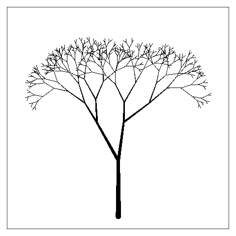
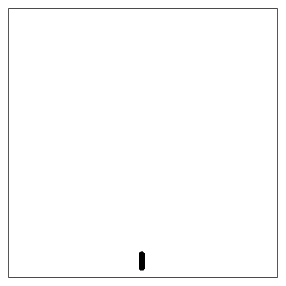

Animated Tree
================

Using animation guidance from:
<https://davetang.org/muse/2015/02/12/animated-plots-using-r/>

``` r
devtools::load_all()
```

    ## Loading swankydoodledandy-project-randomtrees

    ## Invalid DESCRIPTION:
    ## Malformed package name
    ## 
    ## See section 'The DESCRIPTION file' in the 'Writing R Extensions'
    ## manual.

``` r
fractal_tree <- random_trees(splits = 8, children = 2, angle = pi/4, scale_angle = F, random_angles = T, 
                                              random_lengths = T, length_scale = 1.4, plot = F, datadump = T)
```

# Swaying Tree

Generates a random field to create a GIF animation of a tree “swaying”
in the wind.

``` r
swaying_tree(fractal_tree, var = 0.02, scale = 0.4)
```

    ## [1] GIF file saved as swaying_tree_2020-12-07_00:22:06_PST.gif in folder 'swaying_trees'.

Example:



The object used to generate the “wind” is calculated in the manner
below.

``` r
model <- RandomFields::RMexp(var = 0.02, scale = 0.4)
branch_count <- sum(cumprod(fractal_tree$fun_variables$children)) + 1
x <- seq(0, 10, length.out = 100)
y <- seq(0, 10, length.out = branch_count)
simu <- suppressMessages(as.matrix(RandomFields::RFsimulate(model, x, y, grid=TRUE)))

raster::plot(raster::raster(simu))
```

<!-- -->

# Growing Tree

Produces a GIF animation of a “growing” tree

``` r
growing_tree(fractal_tree)
```

    ## [1] GIF file saved as growing_tree_2020-12-07_00:22:08_PST.gif in folder 'growing_trees'.

Example:


