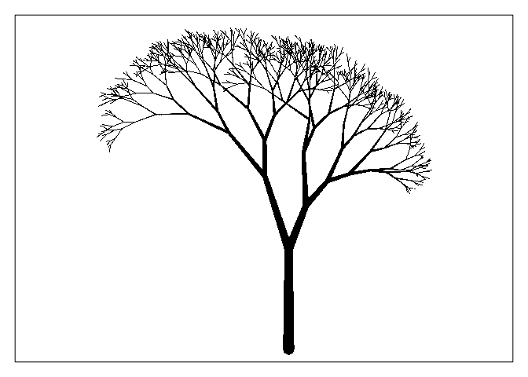
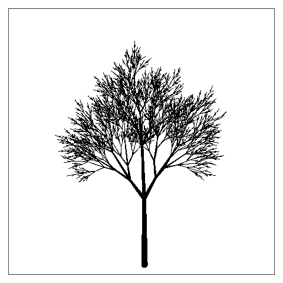

Animated Tree
================

Using animation guidance from:
<https://davetang.org/muse/2015/02/12/animated-plots-using-r/>

``` r
devtools::load_all()
```

To use any of the animation functions you first need to save the output
of a generated tree by setting the argument <b>datadump = T</b> during
tree production. You do not have to set <b>plot = F</b>.

``` r
fractal_tree <- random_tree(splits = 9, children = 2, angle = pi/4, scale_angle = T, random_angles = T, sib_lgth_ratio = c(1.5,1),
                            sib_thk_ratio = c(1,1.5), random_lengths = T, angle_scale = 1.05, length_scale = 1.35, plot = T, datadump = T)
```



``` r
fractal_tree1 <- random_tree(splits = 9, children = 2, angle = pi/4, sib_lgth_ratio = c(1.5,1), sib_thk_ratio = c(1,1.5), 
                             angle_scale = 1.05, length_scale = 1.35, plot = F, datadump = T, title = "fractal_tree1")
fractal_tree2 <- deterministic_tree(splits = 7, trunk_scale = 0.25, angle_scale = 1.25, sib_thk_ratio = c(1,2,1), 
                                    sib_lgth_ratio = c(1,5,1), plot = F, datadump = T, title = "fractal_tree2")
fractal_tree3 <- random_tree(splits = 7, sib_lgth_ratio = c(1,2,1), angle = pi/6, plot = F, datadump = T, title = "fractal_tree3")
```

## Swaying Tree

Generates a random field to create a GIF animation of a tree “swaying”
in the wind.

#### Input arguments

<b>fractal\_tree</b> : The output of <b>random\_trees()</b> or
<b>deterministic\_tree()</b> when <b>datadump = T</b>.<br> <b>var</b> :
(dbl) Indicates variance of the random field. Larger <b>var</b> =\>
stronger “wind”.<br> <b>scale</b> : (dbl) Indicated timescale of wind
patterns. Smaller <b>scale</b> =\> faster wind direction changes.<br>
<b>return\_filename</b> : (lgl) Indicated if the file name of the
generated GIF should be returned.

``` r
filename <- swaying_tree(fractal_tree, var = 0.02, scale = 0.4, return_filename = T)
```

Example:

<center>


</center>

The object used to generate the “wind” is calculated in the manner
below.

``` r
model <- RandomFields::RMexp(var = 0.02, scale = 0.4)
branch_count <- sum(cumprod(fractal_tree$fun_variables$children)) + 1
x <- seq(0, 10, length.out = 100)
y <- seq(0, 10, length.out = branch_count)
simu <- suppressMessages(as.matrix(RandomFields::RFsimulate(model, x, y, grid=TRUE)))

raster::plot(raster::raster(simu))
```


## Growing Tree

Produces a GIF animation of a “growing” tree. The only input is the
<b>datadump</b> output of one the tree generating functions and the
argument indicating whether the filename should be returned. Produces
ten frames per tree level, including level of starter branch/trunk, plus
ten more frames for the final image.

``` r
filename <- growing_tree(fractal_tree, return_filename = T)
```

Example:

<center>


</center>

## Additional Examples

<center>



</center>

<center>


</center>

<center>


</center>

<center>


</center>
