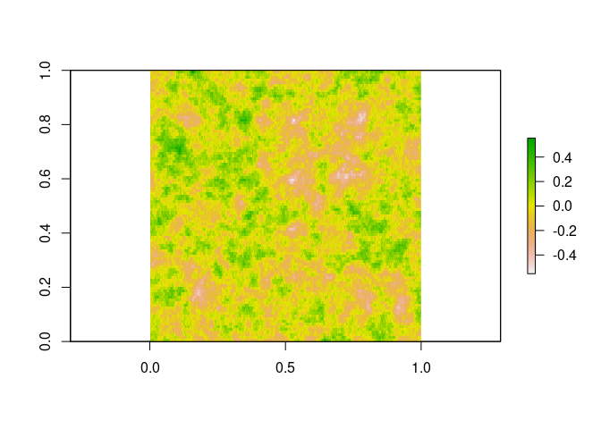

Animated Tree
================

Using animation guidance from:
<https://davetang.org/muse/2015/02/12/animated-plots-using-r/>

``` r
devtools::load_all()
```

    ## Loading swankydoodledandy-project-randomtrees

    ## Invalid DESCRIPTION:
    ## Malformed package name
    ## 
    ## See section 'The DESCRIPTION file' in the 'Writing R Extensions'
    ## manual.

``` r
fractal_tree <- random_trees(splits = 8, children = 2, angle = pi/4, scale_angle = F, random_angles = T, 
                                              random_lengths = T, length_scale = 1.4, plot = F, datadump = T)
```

# Swaying Tree

``` r
swaying_tree <- function(fractal_tree, var = 0.02, scale = 0.4){

  xlim <- c((min(fractal_tree$tree$X) - 0.1*abs(min(fractal_tree$tree$X))),
            (max(fractal_tree$tree$X) + 0.1*abs(max(fractal_tree$tree$X))))
  ylim <- c((min(fractal_tree$tree$Z) - 0.1*abs(min(fractal_tree$tree$Z))),
            (max(fractal_tree$tree$Z) + 0.1*abs(max(fractal_tree$tree$Z))))
  
  level_gen_size <- fractal_tree$fun_variables$level_gen_size
  branch_count <- fractal_tree$fun_variables$branch_count
  children <- fractal_tree$fun_variables$children
  splits <- fractal_tree$fun_variables$splits
  family_tree <- fractal_tree$fun_variables$family_tree
  branch_route_count <- fractal_tree$fun_variables$branch_route_count
  
  model <- RandomFields::RMexp(var = var, scale = scale)
  
  x <- seq(0, 10, length.out = 50)
  y <- seq(0, 10, length.out = branch_count)
  simu <- suppressMessages(as.matrix(RandomFields::RFsimulate(model, x, y, grid=TRUE)))
  
  rename <- function(x){
    return(name <- paste('00', x,'plot.png', sep=''))
  }
  
  path <- fs::path("swaying_trees")
  suppressMessages(usethis::use_directory(path))
  
  for(i in 0:49){
    name <- rename(i+1)
    wind_angles <- simu[i+1,]/
      rep((fractal_tree$fun_variables$splits+1):1, times = c(1,cumprod(fractal_tree$fun_variables$children)))^1.8
    
    X_coords <- fractal_tree$fun_variables$unstacked_X_coords %*% diag(cos(c(wind_angles))) - 
      fractal_tree$fun_variables$unstacked_Z_coords %*% diag(sin(c(wind_angles)))
    Z_coords <- fractal_tree$fun_variables$unstacked_X_coords %*% diag(sin(c(wind_angles))) +
      fractal_tree$fun_variables$unstacked_Z_coords %*% diag(cos(c(wind_angles)))
    
    branch_delta_X <- rep(c(0, X_coords[100,1:(sum(rev(level_gen_size)[-1]))]),
                          c(1, rep(children, level_gen_size[-(splits+1)])))
    X_matrix <- t(apply(matrix(branch_delta_X[family_tree], nrow = splits+1), 2, cumsum))
    branch_start_X <- c(X_matrix)[cumsum(c(1,branch_route_count[-branch_count]))]
    X_coords_stacked <- X_coords + matrix(rep(branch_start_X, each = 100), nrow = 100)
    
    branch_delta_Z <- rep(c(0, Z_coords[100,1:(sum(rev(level_gen_size)[-1]))]),
                          c(1, rep(children, level_gen_size[-(splits+1)])))
    Z_matrix <- t(apply(matrix(branch_delta_Z[family_tree], nrow = splits+1), 2, cumsum))
    branch_start_Z <- c(Z_matrix)[cumsum(c(1,branch_route_count[-branch_count]))]
    Z_coords_stacked <- Z_coords + matrix(rep(branch_start_Z, each = 100), nrow = 100)
    
    png(name)
    par(mar=c(1,1,1,1))
    plot(x = X_coords_stacked, y = Z_coords_stacked,
         pch = 16, cex = fractal_tree$tree$thickness,
         xaxt = "n", yaxt = "n", asp = 1,
         xlab = NA, ylab = NA,
         xlim = xlim, ylim = ylim)
    
    dev.off()
  }
  
  #run ImageMagick
  filename <- paste("swaying_tree_", gsub(" ", "_", format(Sys.time(), format = "%F %T %Z")),".gif", sep = "")
  system(paste("convert *.png -delay 200x100 -loop 0 ", "swaying_trees/", filename, sep = ""))
  #invisible(file.remove(list.files(pattern=".png")))
  invisible(file.remove(list.files(pattern=".png")))
  
  rm(levels, family, xlim, ylim, X_coords, Z_coords, X_coords_stacked, 
     Z_coords_stacked, model, branch_count, x, y, simu, file_name, name, wind_angles)
  
  return(noquote(paste("GIF file saved as ", filename, " in folder 'swaying_trees'.", sep = "")))
}
```


``` r
model <- RandomFields::RMexp(var = 0.02, scale = 0.4)
branch_count <- sum(cumprod(fractal_tree$fun_variables$children)) + 1
x <- seq(0, 10, length.out = 100)
y <- seq(0, 10, length.out = branch_count)
simu <- suppressMessages(as.matrix(RandomFields::RFsimulate(model, x, y, grid=TRUE)))

raster::plot(raster::raster(simu))
```

<!-- -->

``` r
swaying_tree(fractal_tree, var = 0.02, scale = 0.4)
```

    ## Warning in rm(levels, family, xlim, ylim, X_coords, Z_coords,
    ## X_coords_stacked, : object 'levels' not found

    ## Warning in rm(levels, family, xlim, ylim, X_coords, Z_coords,
    ## X_coords_stacked, : object 'family' not found

    ## Warning in rm(levels, family, xlim, ylim, X_coords, Z_coords,
    ## X_coords_stacked, : object 'file_name' not found

    ## [1] GIF file saved as swaying_tree_2020-12-07_00:03:29_PST.gif in folder 'swaying_trees'.

# Growing Tree

``` r
growing_tree <- function(fractal_tree){
  
  xlim <- c((min(fractal_tree$tree$X) - 0.1*abs(min(fractal_tree$tree$X))),
            (max(fractal_tree$tree$X) + 0.1*abs(max(fractal_tree$tree$X))))
  ylim <- c((min(fractal_tree$tree$Z) - 0.1*abs(min(fractal_tree$tree$Z))),
            (max(fractal_tree$tree$Z) + 0.1*abs(max(fractal_tree$tree$Z))))
  
  branch_count <- fractal_tree$fun_variables$branch_count
  splits <- fractal_tree$fun_variables$splits
  level_gen_size <- fractal_tree$fun_variables$level_gen_size
  
  frames <- t(matrix(1:(5*(splits+1)), nrow = 5))
  grow_index <- rep(unlist(lapply(1:(splits+1), function(x) rep(frames[x,], level_gen_size[x]))), each = 20)
  
  fractal_tree$tree$grow_index <- grow_index
  
  rename <- function(x){
    return(name <- paste('00', x,'plot.png', sep=''))
  }
  
  path <- fs::path("growing_trees")
  suppressMessages(usethis::use_directory(path))
  
  for(i in 1:max(frames)){
    name <- rename(i)
    
    tree <- fractal_tree$tree[which(fractal_tree$tree$grow_index < i+1),]
    
    png(name)
    par(mar=c(1,1,1,1))
    plot(x = tree$X, 
         y = tree$Z,
         pch = 16, cex = tree$thickness,
         xaxt = "n", yaxt = "n", asp = 1,
         xlab = NA, ylab = NA,
         xlim = xlim, ylim = ylim)
    
    dev.off()
  }
  
  #run ImageMagick
  filename <- paste("growing_tree_", gsub(" ", "_", format(Sys.time(), format = "%F %T %Z")),".gif", sep = "")
  system(paste("convert *.png -delay 200x100 -loop 0 ", "growing_trees/", filename, sep = ""))
  #invisible(file.remove(list.files(pattern=".png")))
  invisible(file.remove(list.files(pattern=".png")))
  
  rm(tree, grow_index, frames)
  
  return(noquote(paste("GIF file saved as ", filename, " in folder 'growing_trees'.", sep = "")))
}
```

``` r
growing_tree(fractal_tree)
```

    ## [1] GIF file saved as growing_tree_2020-12-07_00:03:30_PST.gif in folder 'growing_trees'.


