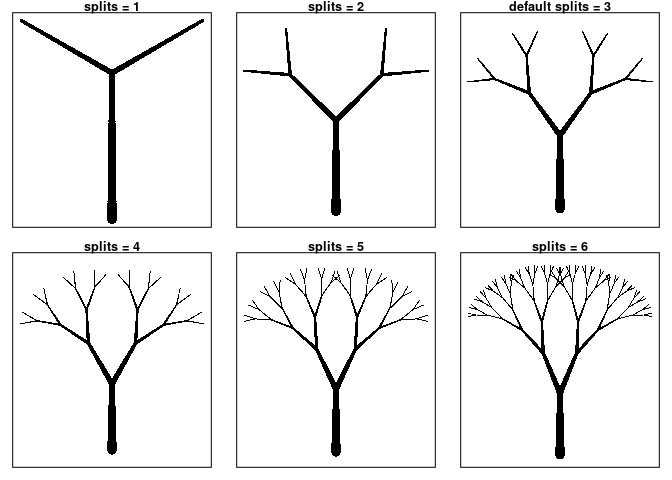
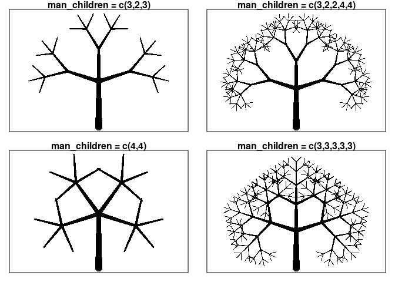

Basic Deterministic Trees
================

``` r
library(tidyverse)
```

Early attempts at making, storing, and drawing line segments.

``` r
gr <- 1.61803

X0 <- rep(0, 100)
Y0 <- seq(0, 1, length.out = 100)

theta_0 <- 0
b_0 <- tibble(x = round(X0*cos(theta_0) - Y0*sin(theta_0), 3),
              y = round(X0*sin(theta_0) + Y0*cos(theta_0), 3),
              branch = rep(0,100),
              thickness = seq(1, 1/gr, length.out = 100))
tree <- b_0

ggplot(tree) + 
  geom_point(aes(x, y, size = thickness)) +
  coord_fixed() + theme(legend.position="none")
```

<!-- -->

Try to rotate

``` r
X1 <- rep(0, 100)
Y1 <- seq(0, 1/gr, length.out = 100)

theta_01a = theta_0 + pi/6
b_01a <- tibble(x = round(X1*cos(theta_01a) - Y1*sin(theta_01a) + b_0$x[100], 3),
                y = round(X1*sin(theta_01a) + Y1*cos(theta_01a) + b_0$y[100], 3),
                branch = rep("1a", 100),
                thickness = seq(1/gr,1/gr^2, length.out = 100))

tree <- rbind(tree,b_01a)

theta_01b = theta_0 - pi/6
b_01b <- tibble(x = round(X1*cos(theta_01b) - Y1*sin(theta_01b) + b_0$x[100], 3),
                y = round(X1*sin(theta_01b) + Y1*cos(theta_01b) + b_0$y[100], 3),
                branch = rep("1b", 100),
                thickness = seq(1/gr,1/gr^2, length.out = 100))

tree <- rbind(tree,b_01b)

ggplot(tree) + 
  geom_point(aes(x, y, size = thickness)) + 
  coord_fixed() + theme(legend.position="none")
```

<!-- -->

``` r
X2 <- rep(0, 100)
Y2 <- seq(0, 1/gr^2, length.out = 100)

theta_01a2a = theta_01a + pi/6/gr
b_01a2a <- tibble(x = round(X2*cos(theta_01a2a) - Y2*sin(theta_01a2a) + b_01a$x[100], 3),
                  y = round(X2*sin(theta_01a2a) + Y2*cos(theta_01a2a) + b_01a$y[100], 3),
                  branch = rep("2a", 100),
                  thickness = seq(1/gr^2,1/gr^3, length.out = 100))

tree <- rbind(tree,b_01a2a)

theta_01a2b = theta_01a - pi/6/gr
b_01a2b <- tibble(x = round(X2*cos(theta_01a2b) - Y2*sin(theta_01a2b) + b_01a$x[100], 3),
                  y = round(X2*sin(theta_01a2b) + Y2*cos(theta_01a2b) + b_01a$y[100], 3),
                  branch = rep("2b", 100),
                  thickness = seq(1/gr^2,1/gr^3, length.out = 100))

tree <- rbind(tree,b_01a2b)

theta_01b2c = theta_01b + pi/6/gr
b_01b2c <- tibble(x = round(X2*cos(theta_01b2c) - Y2*sin(theta_01b2c) + b_01b$x[100], 3),
                  y = round(X2*sin(theta_01b2c) + Y2*cos(theta_01b2c) + b_01b$y[100], 3),
                  branch = rep("2c", 100),
                  thickness = seq(1/gr^2,1/gr^3, length.out = 100))

tree <- rbind(tree,b_01b2c)

theta_01b2d = theta_01b - pi/6/gr
b_01b2d <- tibble(x = round(X2*cos(theta_01b2d) - Y2*sin(theta_01b2d) + b_01b$x[100], 3),
                  y = round(X2*sin(theta_01b2d) + Y2*cos(theta_01b2d) + b_01b$y[100], 3),
                  branch = rep("2d", 100),
                  thickness = seq(1/gr^2,1/gr^3, length.out = 100))
?seq
tree <- rbind(tree,b_01b2d)

ggplot(tree) + 
  geom_point(aes(x, y, size = thickness)) + 
  coord_fixed() + theme(legend.position="none")
```

<!-- -->
