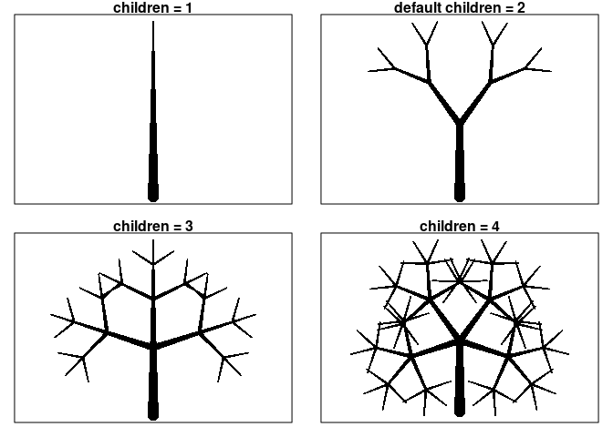

Basic Deterministic Trees
================

``` r
library(tidyverse)
```

Early attempts at making, storing, and drawing line segments.

``` r
X0 <- rep(0, 100)
Y0 <- seq(0, 1, length.out = 100)

theta0 <- 0
b0 <- tibble(x = round(X0*cos(theta0) - Y0*sin(theta0), 3),
             y = round(X0*sin(theta0) + Y0*cos(theta0), 3),
             branch = rep(0,100),
             thickness = rep(1/sqrt(2), 100))
tree <- b0

ggplot(tree) + 
  geom_point(aes(x, y))
```

<!-- -->

Try to rotate

``` r
tree <- b0

X1 <- rep(0, 100)
Y1 <- seq(0, 0.5, length.out = 100)

theta1a = theta0 + pi/6
b1a <- tibble(x = round(X1*cos(theta1a) - Y1*sin(theta1a) + b0$x[100], 3),
              y = round(X1*sin(theta1a) + Y1*cos(theta1a) + b0$y[100], 3),
              branch = rep("1a", 100),
              thickness = rep(1/sqrt(2.5), 100))

tree <- rbind(tree,b1a)

theta1b = theta0 - pi/6
b1b <- tibble(x = round(X1*cos(theta1b) - Y1*sin(theta1b) + b0$x[100], 3),
              y = round(X1*sin(theta1b) + Y1*cos(theta1b) + b0$y[100], 3),
              branch = rep("1b", 100),
              thickness = rep(1/sqrt(2.5), 100))

tree <- rbind(tree,b1b)

ggplot(tree) + 
  geom_point(aes(x, y))
```

<!-- -->
