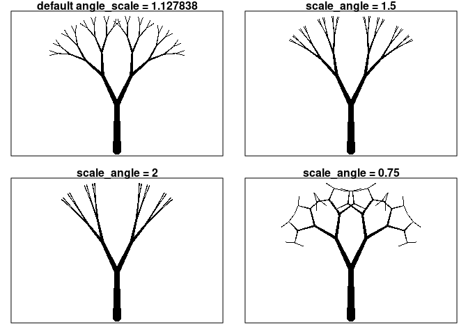
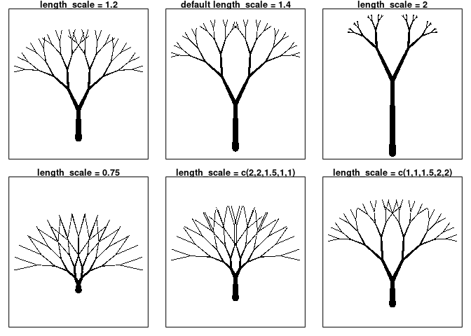
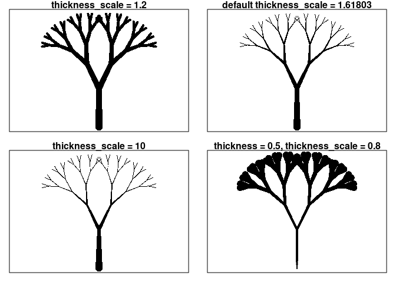
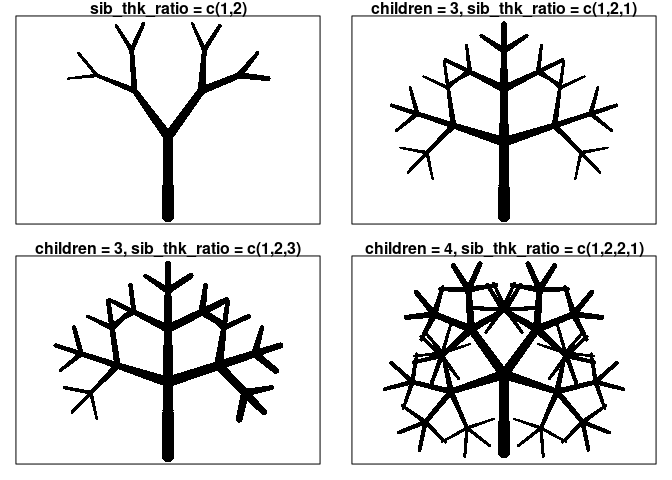
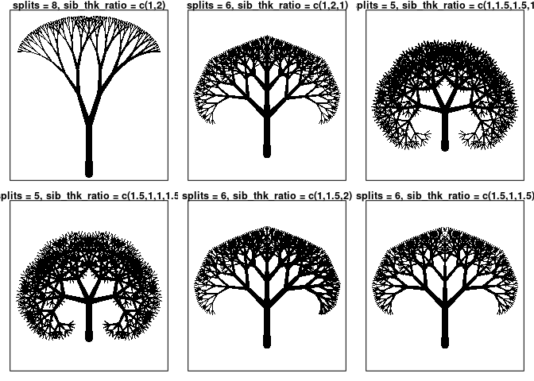

Deterministic Trees
================

``` r
devtools::load_all()
```

# Develop recursive function to make trees from deterministic inputs here.

### Input arguments

<b>splits</b> : (int) Indicates number of levels beyond starting branch.
<br> <b>length</b> : (dbl) Indicates length of a branch. <br>
<b>scale\_length</b> : (lgl) Indicates if lengths should be scaled at
each new level. <br> <b>length\_scale</b> : (dbl) Indicates rate in
which branch lengths shorten at each level. Vector or single value. <br>
<b>trunk\_scale</b> : (dbl) Used to vary the relative size of the
“trunk” <b>children</b> : (int) Indicates number of new branches at
each new level. <br> <b>start\_angle</b> : (dbl) Indicates angle in
radians of starting branch, measured ccw from +y direction. <br>
<b>angle</b> : (dbl) Indicates angle in radian between each branch at a
split. <br> <b>scale\_angle</b> : (lgl) Indicates if branch split angles
should be scaled at each new level. <br> <b>angle\_scale</b> : (lgl)
Indicates rate at which angles should decrease <br> <b>thickness</b> :
(dbl) Indicates thickness of a branch. <br> <b>scale\_thickness</b> :
(lgl) Indicates if thickness should should shrink at each new level <br>
<b>thickness\_scale</b> : (dbl) Indicates rate in which branch
thicknesses should shrink <br> <b>taper</b> : (lgl) Indicates if
branches should taper. <br> <br> <b>man\_lengths</b> : Manually select
branch length for starting branch and branches at each level. <br>
<b>man\_angles</b> : Manually select angles between branches at each
split by level. <br> <b>man\_split\_thickness</b> : Manually select
thickness of each branch at each split in order. <br>
<b>man\_begin\_thick</b> : Manually select starting thickness. <br>
<b>man\_end\_thick</b> : Manually select ending thickness. <br>
<b>man\_children</b> : Manually select number of branches at split by
level. <br> <b>sib\_ratio</b> : Only works if equal number of children
at each split. Indicates relative size of children. <br> <br>
<b>title</b> : (chr) Optional title for output tree. <br> <b>plot</b> :
(lgl) Default to T for plotting <br> <b>datadump</b> : (lgl) Default to
F. Set to T get relevant data.

### First try at function

### Testing “splits” input with others set to default

``` r
par(mfrow=c(2,3), mar=c(1,1,1,1))
deterministic_tree(splits = 1, title = "splits = 1")
deterministic_tree(splits = 2, title = "splits = 2")
deterministic_tree(title = "default splits = 3")
deterministic_tree(splits = 4, title = "splits = 4")
deterministic_tree(splits = 5, title = "splits = 5")
deterministic_tree(splits = 6, title = "splits = 6")
```

<!-- -->

``` r
# Check for improper "splits" input
rbind(deterministic_tree(splits = 0.3),
      deterministic_tree(splits = -2),
      deterministic_tree(splits = "test"))
```

    ##      [,1]                                      
    ## [1,] "error: splits must be a positive integer"
    ## [2,] "error: splits must be a positive integer"
    ## [3,] "error: splits must be a positive integer"

### Test “children” and “man\_children” with others set to default

``` r
par(mfrow=c(2,2), mar=c(1,1,1,1))
deterministic_tree(children = 1, title = "children = 1")
deterministic_tree(title = "default children = 2")
deterministic_tree(children = 3, title = "children = 3")
deterministic_tree(children = 4, title = "children = 4")
```

<!-- -->

``` r
par(mfrow=c(2,2), mar=c(1,1,1,1))
deterministic_tree(man_children = c(2,3,4), title = "man_children = c(2,3,4)") # Currently experiencing issues
```

    ## Warning in rbind(rep(0, prod(children)), t(matrix(unlist(lapply(1:splits, :
    ## number of columns of result is not a multiple of vector length (arg 1)

``` r
deterministic_tree(man_children = c(3,2,3), title = "man_children = c(3,2,3)")
# Having "man_children" length =/= "splits" changes "splits" to length.
deterministic_tree(man_children = 4, title = "man_children = 4")
deterministic_tree(man_children = c(3,3,3,3,3), title = "man_children = c(3,3,3,3,3)")
```

<!-- -->

### The role of tapering and scaling at each split for “splits = 5”

``` r
par(mfrow=c(2,3), mar=c(1,1,1,1))
deterministic_tree(splits = 5, title = "all = T")
deterministic_tree(splits = 5, taper = F, title = "scale_thickness = T, taper = F")
deterministic_tree(splits = 5, scale_thickness = F, taper = F, title = "scale_thickness = F, taper = F")
deterministic_tree(splits = 5, scale_length = F, title = "scale_length = F")
deterministic_tree(splits = 5, scale_angle = F, title = "scale_angle = F")

# Check for improper inputs
rbind(deterministic_tree(taper = 2),
      deterministic_tree(scale_length = "test"),
      deterministic_tree(scale_angle = 1.5))
```

    ##      [,1]                                                 
    ## [1,] "error: taper should be given a logical value"       
    ## [2,] "error: scale_length should be given a logical value"
    ## [3,] "error: scale_angle should be given a logical value"

<!-- -->

### Exploring “angle\_scale” with “splits = 5”

``` r
par(mfrow=c(2,2), mar=c(1,1,1,1))
deterministic_tree(splits = 5, title = "default angle_scale = 1.127838")
deterministic_tree(splits = 5, angle_scale = 1.5, title = "scale_angle = 1.5")
deterministic_tree(splits = 5, angle_scale = 2, title = "scale_angle = 2")
deterministic_tree(splits = 5, angle_scale = 0.75, title = "scale_angle = 0.75")
```

<!-- -->

### Exploring “length\_scale” with “splits = 5”

``` r
par(mfrow=c(2,3), mar=c(1,1,1,1))
deterministic_tree(splits = 5, length_scale = 1.2, title = "length_scale = 1.2")
deterministic_tree(splits = 5, title = "default length_scale = 1.4")
deterministic_tree(splits = 5, length_scale = 2, title = "length_scale = 2")
deterministic_tree(splits = 5, length_scale = 0.75, title = "length_scale = 0.75")
deterministic_tree(splits = 5, length_scale = c(2,2,1.5,1,1), title = "length_scale = c(2,2,1.5,1,1)")
deterministic_tree(splits = 5, length_scale = c(1,1,1.5,2,2), title = "length_scale = c(1,1,1.5,2,2)")
```

<!-- -->

### Exploring “thickness\_scale” with “splits = 5”. Starting thickness = 2 unless stated otherwise.

``` r
par(mfrow=c(2,2), mar=c(1,1,1,1))
deterministic_tree(splits = 5, thickness_scale = 1.2, title = "thickness_scale = 1.2")
deterministic_tree(splits = 5, title = "default thickness_scale = 1.61803")
deterministic_tree(splits = 5, thickness_scale = 2, title = "thickness_scale = 10")
# Values less than 1 increase thickness
deterministic_tree(splits = 5, thickness_scale = 0.8, thickness = 0.5, title = "thickness = 0.5, thickness_scale = 0.8")
```

<!-- -->

### Exploring “sib\_lgth\_ratio” -\> “children” determined by length of vector “sib\_lgth\_ratio”

``` r
par(mfrow=c(2,2), mar=c(1,1,1,1))
deterministic_tree(sib_lgth_ratio = c(1,2), title = "sib_lgth_ratio = c(1,2)")
deterministic_tree(sib_lgth_ratio = c(1,2,1), title = "children = 3, sib_lgth_ratio = c(1,2,1)")
# As written if branch given a length of zero, that doesn't mean it won't still have its own children
deterministic_tree(sib_lgth_ratio = c(1,0,1), title = "children = 3, sib_lgth_ratio = c(1,0,1)")
deterministic_tree(sib_lgth_ratio = c(1,2,2,1), title = "children = 4, sib_lgth_ratio = c(1,2,2,1)")
```

<!-- -->

``` r
par(mfrow=c(2,3), mar=c(1,1,1,1))
deterministic_tree(splits = 8, sib_lgth_ratio = c(1,2), title = "splits = 8, sib_lgth_ratio = c(1,2)")
deterministic_tree(splits = 6, sib_lgth_ratio = c(1,2,1), title = "splits = 6, sib_lgth_ratio = c(1,2,1)")
deterministic_tree(splits = 5, sib_lgth_ratio = c(1,2,2,1), title = "splits = 5, sib_lgth_ratio = c(1,2,2,1)")
deterministic_tree(splits = 5, sib_lgth_ratio = c(2,1,1,2), title = "splits = 5, sib_lgth_ratio = c(1,2,2,1)")
deterministic_tree(splits = 6, sib_lgth_ratio = c(1,2,3), title = "splits = 6, sib_lgth_ratio = c(1,2,3)")
deterministic_tree(splits = 6, sib_lgth_ratio = c(2,1,2), title = "splits = 6, sib_lgth_ratio = c(1,2,3)")
```

<!-- -->

### Similarly, “sib\_thk\_ratio” effects the thickness.

``` r
par(mfrow=c(2,3), mar=c(1,1,1,1))
deterministic_tree(splits = 8, sib_thk_ratio = c(1,2), title = "splits = 8, sib_thk_ratio = c(1,2)")
deterministic_tree(splits = 6, sib_thk_ratio = c(1,2,1), title = "splits = 6, sib_thk_ratio = c(1,2,1)")
deterministic_tree(splits = 5, sib_thk_ratio = c(1,2,2,1), title = "splits = 5, sib_thk_ratio = c(1,2,2,1)")
deterministic_tree(splits = 5, sib_thk_ratio = c(2,1,1,2), title = "splits = 5, sib_thk_ratio = c(1,2,2,1)")
deterministic_tree(splits = 6, sib_thk_ratio = c(1,2,3), title = "splits = 6, sib_thk_ratio = c(1,2,3)")
deterministic_tree(splits = 6, sib_thk_ratio = c(2,1,2), title = "splits = 6, sib_thk_ratio = c(1,2,3)")
```

<!-- -->

### Explore “trunk\_scale”. It simply shrinks the starter branch. Other arguments: “splits = 6, angle\_scale = 1.25, sib\_lgth\_ratio = c(1,5,1), sib\_thk\_ratio = c(1,2,1)”

``` r
par(mfrow=c(1,3), mar=c(1,1,1,1))
deterministic_tree(splits = 6, angle_scale = 1.25, sib_thk_ratio = c(1,2,1), sib_lgth_ratio = c(1,5,1), title = "default: trunk_scale = 1")
deterministic_tree(splits = 6, trunk_scale = 0.75, angle_scale = 1.25, sib_thk_ratio = c(1,2,1), sib_lgth_ratio = c(1,5,1), title = "trunk_scale = 0.75")
deterministic_tree(splits = 6, trunk_scale = 0.25, angle_scale = 1.25, sib_thk_ratio = c(1,2,1), sib_lgth_ratio = c(1,4,1), title = "trunk_scale = 0.25")
```

<!-- -->
