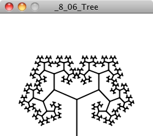

```{r, message = F, warning = F}
devtools::load_all()
```




```{r}
par(mfrow=c(1,3), mar=c(1,1,1,1))
deterministic_tree(splits = 8, children = 2, angle = 9*pi/12, scale_angle = F, 
                   scale_thickness = F, taper = F, thickness = 0.5, length_scale = 1.5)
deterministic_tree(splits = 8, children = 2, angle = pi/4, scale_angle = F, 
                   scale_thickness = F, taper = F, thickness = 0.5, length_scale = 1.5)
deterministic_tree(splits = 8, children = 2, angle = pi/20, scale_angle = F, 
                   scale_thickness = F, taper = F, thickness = 0.5, length_scale = 1.5)
```