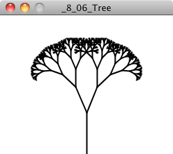

Nature of Code - Example 8.6
================

``` r
devtools::load_all()
```

    ## Loading swankydoodledandy-project-randomtrees

    ## Invalid DESCRIPTION:
    ## Malformed package name
    ## 
    ## See section 'The DESCRIPTION file' in the 'Writing R Extensions'
    ## manual.





``` r
par(mfrow=c(1,3), mar=c(1,1,1,1))
basic_deterministic_trees(splits = 8, children = 2, angle = 9*pi/12, scale_angle = F, 
                          scale_thickness = F, taper = F, thickness = 0.5, length_scale = 1.5)
```

    ## Warning: replacing previous import 'vctrs::data_frame' by 'tibble::data_frame'
    ## when loading 'dplyr'

``` r
basic_deterministic_trees(splits = 8, children = 2, angle = pi/4, scale_angle = F, 
                          scale_thickness = F, taper = F, thickness = 0.5, length_scale = 1.5)
basic_deterministic_trees(splits = 8, children = 2, angle = pi/20, scale_angle = F, 
                          scale_thickness = F, taper = F, thickness = 0.5, length_scale = 1.5)
```

<!-- -->
