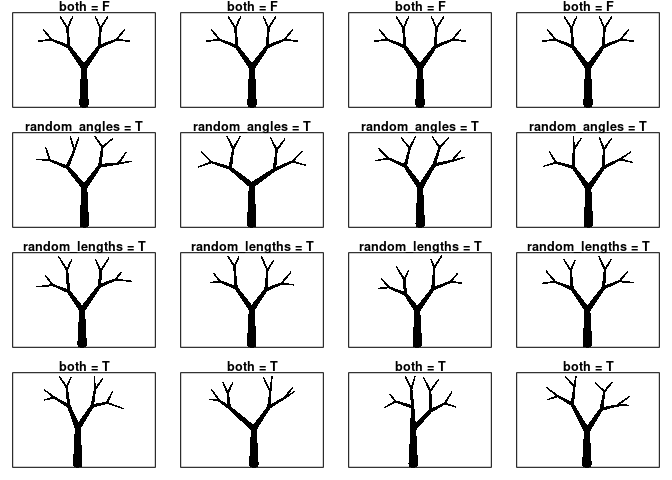
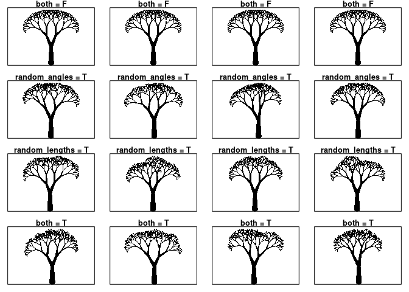
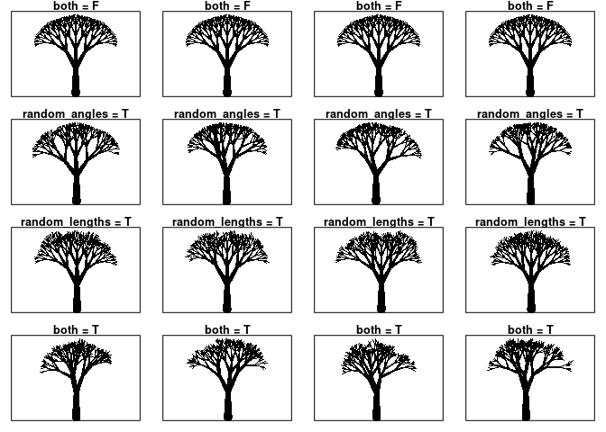
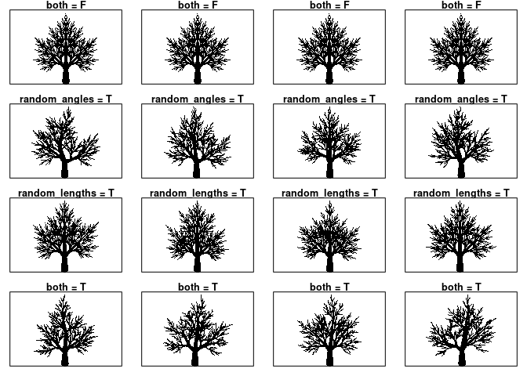

Random Trees
================

The first iteration is labelled here as “random\_trees\_old”.
Vectorization has resulted in a much faster function. A comparison is
matter further down after some testing and demonstrations.

``` r
devtools::load_all()
```

### Input arguments not in “deterministic\_trees”

<b>random\_angles</b> : (lgl) Toggles angle noise on/off. <br>
<b>angle\_variance</b> : (dbl) Indicates base variance for angle noise.
By default “set” to zero be given value later. <b>random\_lengths</b> :
(lgl) Toggles length noise on/off. <br> <b>length\_variance</b> : (dbl)
Indicates base variance for length noise. By default “set” to zero be
given value later.

## Exploring effects of “random\_angles = T” and “random\_lengths” with default variance values

### Default values

<b>angle\_variance \<- (angles\[2\]/(children\[1\]+1))^2</b> <br>
<b>length\_variance \<- lengths\[1\]/24</b> <br>

``` r
titles <- rep(c("both = F", "random_angles = T", "random_lengths = T", "both = T"), each = 4)
ras <- rep(c(F,F,F,F,T,T,T,T), 2)
rls <- c(rep(F,8),rep(T,8))
```

### Default tree

``` r
par(mfrow=c(4,4), mar=c(1,1,1,1))
for(i in 1:16){
  random_trees(random_angles = ras[i], random_lengths = rls[i], title = titles[i])
}
```

<!-- -->

### splits = 8, children = 2, angle = pi/4, scale\_angle = F, length\_scale = 1.4

``` r
par(mfrow=c(4,4), mar=c(1,1,1,1))
for(i in 1:16){
  random_trees(splits = 8, children = 2, angle = pi/4, scale_angle = F, length_scale = 1.4, random_angles = ras[i], random_lengths = rls[i], title = titles[i])
}
```

<!-- -->

### splits = 5, children = 3, angle = pi/6, length\_scale = 1.4

``` r
par(mfrow=c(4,4), mar=c(1,1,1,1))
for(i in 1:16){
  random_trees(splits = 5, children = 3, angle = pi/6, length_scale = 1.4, random_angles = ras[i], random_lengths = rls[i], title = titles[i])
}
```

<!-- -->

### splits = 6, trunk\_scale = 0.75, angle\_scale = 1.25, sib\_ratio = c(1,3,1)

``` r
par(mfrow=c(4,4), mar=c(1,1,1,1))
for(i in 1:16){
  random_trees(splits = 6, trunk_scale = 0.5, angle_scale = 1.25, sib_lgth_ratio = c(1,3,1), random_angles = ras[i], random_lengths = rls[i], title = titles[i])
}
```

<!-- -->

## The old “random\_trees()”

``` r
random_trees_old <- function(splits = 3, 
                         length = 2,
                         scale_length = T,
                         length_scale = 1.4,
                         trunk_scale = 1,
                         children = 2,
                         start_angle = 0,
                         angle = pi/(splits/2 + 1),
                         scale_angle = T,
                         angle_scale = sqrt(1.272018),
                         thickness = 2,
                         scale_thickness = T,
                         thickness_scale = 1.61803,
                         taper = T,
                         man_lengths = 0,
                         man_angles = 0,
                         man_split_thickness = 0,
                         man_begin_thick = 0,
                         man_end_thick = 0,
                         man_children = 0,
                         sib_ratio = 0,
                         title = NA,
                         plot = T,
                         datadump = F,
                         random_angles = T,
                         angle_variance = 0,
                         random_lengths = T,
                         length_variance = 0){
  
  
  if(typeof(splits) != "double" || splits %% 1 != 0 || splits <= 0){
    return("error: splits must be a positive integer")
  }
  if(!any(c(0,1,F,T,FALSE,TRUE) == scale_length)){
    return("error: scale_length should be given a logical value")
  }
  if(!any(c(0,1,F,T,FALSE,TRUE) == scale_angle)){
    return("error: scale_angle should be given a logical value")
  }
  if(!any(c(0,1,F,T,FALSE,TRUE) == taper)){
    return("error: taper should be given a logical value")
  }
  if(!any(c(0,1,F,T,FALSE,TRUE) == scale_thickness)){
    return("error: scale_thickness should be given a logical value")
  }
  
  inputs = list(splits = splits,
                length = length,
                scale_length = scale_length,
                length_scale = length_scale,
                trunk_scale = trunk_scale,
                children = children,
                start_angle = start_angle,
                angle = angle,
                scale_angle = scale_angle,
                angle_scale = angle_scale,
                thickness = thickness,
                scale_thickness = scale_thickness,
                thickness_scale = thickness_scale,
                taper = taper,
                man_lengths = man_lengths,
                man_split_thickness = man_split_thickness,
                man_begin_thick = man_begin_thick,
                man_end_thick = man_end_thick,
                man_children = man_children,
                sib_ratio = sib_ratio,
                title = title,
                plot = plot,
                datadump = datadump,
                random_angles = random_angles,
                angle_variance = angle_variance,
                random_lengths = random_lengths,
                length_variance = length_variance)
  
  # Get information on number of splits at each level
  if(any(as.logical(man_children))){ # Uses manually selected common children amounts at each split
    if(length(man_children) != splits){
      splits <- length(man_children)
    }
    children <- man_children[1:splits]
  }
  else if(any(as.logical(sib_ratio))){ # Uses manually selected common children amounts at each split
    children <- rep(length(sib_ratio), splits)
  }
  else{ # All splits have same number of children
    children <- rep(children, splits)
  }
  if(any(children %% 1 != 0 || children <= 0 || typeof(children) != "double")){
    paste("error: input for children/man_children/sib_ratio should be an integer/vector of integers.")
  }
  
  # Get branch angle information
  if(man_angles){ # Uses manually selected angles between branches for each split level
    angles <- man_angles
    scale_angle <- F # Manual angles not scaleable within current scope
  } else if(scale_angle){ # Iteratively scales selected angle by constant factor at each split
    angles <- c(start_angle, purrr::map_dbl(1:splits, ~ angle/angle_scale^(. - 1)))
  } else{ # Uses constant angle between branches at splits
    angles <- c(start_angle, rep(angle, splits))
  }
  # Get the total angle for each branch, including starting branch
  angles <- c(rep(angles[1], prod(children)), 
              unlist(purrr::map(1:splits,
                                ~ rep(rep(angles[.+1]*(((children[.]-1)/2):(-(children[.]-1)/2)), 
                                          each = prod(children[-(1:.)])), 
                                      times = if(.==1){1}else{prod(children[1:(.-1)])}))))
  angle_matrix <- matrix(angles, ncol = splits + 1)
  angles <- c(start_angle, 
              unlist(purrr::map(1:splits, ~ 
                                  angle_matrix[seq(1,prod(children),prod(children[-(1:.)])),1:(.+1)] 
                                %*% rep(1,.+1))))
  # Add randomness for angles if applicable
  if(random_angles){
    if(angle_variance == 0){
      angle_variance <- (angles[2]/4)^2
    }
    angle_noise <- rnorm(length(angles[-1]), mean = 0, sd = sqrt(angle_variance))
    angles <- angles + c(0,angle_noise)
  } else{
    angle_noise <- rep(0, length(angles[-1]))
  }
  
  # Get branch length information and make table of starting lines
  X <- rep(0, 100)
  if(man_lengths){
    lengths <- man_lengths
    scale_length <- F # Manual lengths not scaleable within current scope
    Zs <- purrr::map_dfc(lengths, ~ seq(0, ., length.out=100))
    Zs <- purrr::set_names(Zs, purrr::map_chr(0:splits, ~ paste(.)))
  }
  if(scale_length){
    if(length(length_scale) < splits){
      length_scale <- rep(length_scale, splits)
    }
    lengths <- purrr::map_dbl(1:(splits+1), ~ length/prod(c(1,length_scale)[1:.]))
    lengths <- lengths %*% diag(c(trunk_scale,rep(1,splits)))
    Zs <- suppressMessages(purrr::map_dfc(lengths, ~ seq(0, ., length.out=100)))
    Zs <- purrr::set_names(Zs, purrr::map_chr(0:splits, ~ paste(.)))
  } else{
    lengths <- rep(length, splits+1)
    lengths <- lengths %*% diag(c(trunk_scale,rep(1,splits)))
    Zs <- suppressMessages(purrr::map_dfc(lengths, ~ seq(0, 1, length.out=100)))
    Zs <- purrr::set_names(Zs, purrr::map_chr(0:splits, ~ paste(.)))
  }
  # Make matrices of unrotated/unstacked coordinates
  Z_coords <- matrix(unlist(purrr::map(1:(splits+1), 
                                       ~ rep(Zs[,.], times = if(.==1){1}else{prod(children[1:(.-1)])}))), 
                     ncol = length(angles))
  X_coords <- matrix(rep(0, 100*sum(c(1,cumprod(children)))), nrow = 100)
  # If "sib_ratio" selected, rescales lengths
  if(length(sib_ratio)>1){
    sib_ratio <- sib_ratio/max(sib_ratio)
    sib_ratio <- c(1, rep(sib_ratio, sum(cumprod(c(1,children[-1])))))
    Z_coords <- Z_coords %*% diag(sib_ratio)
  } else {
    sib_ratio <- rep(1, sum(c(1,cumprod(children))))
  }
  
  lengths <- sib_ratio * rep(lengths, times =  c(1,cumprod(children)))
  # Add randomness for lengths if applicable
  if(random_lengths){
    if(length_variance == 0){
      length_variance <- lengths[1]/24
    }
    length_noise <- rnorm(length(angles[-1]), mean = 0, sd = sqrt(length_variance))
    length_noise <- length_noise/rep(1:splits, cumprod(children))
    Z_coords <- Z_coords %*% diag(1 + c(0,length_noise)/lengths)
  } else{
    length_noise <- rep(0, length(angles[-1]))
  }
  
  # Rotate coordinates
  X_coords <- - Z_coords %*% diag(sin(angles))
  Z_coords <- Z_coords %*% diag(cos(angles))
  # Make branch address matrix
  levels <- rep(0:splits, times = c(1,cumprod(children)))
  gensize <- cumprod(children)
  gen_index <- cbind(unlist(purrr::map(1:length(gensize), ~1:gensize[.])), 
                     c(rep(1:splits, times = cumprod(children))))
  
  family <- rbind(rep(1,prod(children)),
                  do.call(rbind, purrr::map(1:splits, ~ rep((cumsum(c(1,gensize))[.]+1):(cumsum(c(1,gensize))[.+1]), 
                                                            each = prod(children[-(1:.)])))))
  family <- purrr::map(1:(splits+1), ~ matrix(family[1:.,seq(1,prod(children),
                                                             by=if(.==(splits+1)){1}else{prod(children[.:splits])})],
                                              ncol = c(1,gensize)[.]))
  
  paths <- unlist(purrr::map(1:splits, ~ rep(rep(1:children[.], each = prod(children[-(1:.)])), 
                                             times = if(.==1){1}else{prod(children[1:(.-1)])})))
  paths <- matrix(paths, ncol = splits)
  paths <- purrr::map(1:splits, 
                      ~ matrix(paths[seq(1,prod(children),by=if(.==splits){1}else{prod(children[(.+1):splits])}),1:.],
                               nrow = gensize[.]))
  # Branch naming
  # names1 favors relative sibling information at each split
  names1 <- c("b1_0", suppressMessages(purrr::map_chr(1:length(levels[-1]), 
                                     ~ paste(c("b",.+1,"_0", paths[[levels[-1][.]]][gen_index[.,1], 1:gen_index[.,2]]), collapse = ""))))
  # names2 favors parent information
  names2 <- c("b_1", suppressMessages(purrr::map_chr(1:length(levels[-1]), 
                                    ~ paste(c("b_1", matrix(t(family[[levels[-1][.]+1]])[,-1], 
                                                            nrow = gensize[levels[.+1]])[gen_index[.,1], 1:gen_index[.,2]]), collapse = "_"))))
  # Stack coordinates
  X_coords_stacked <- unlist(purrr::map(1:ncol(X_coords), ~ if(.==1){X_coords[,.]}
                                        else{X_coords[,.]<-X_coords[,.]+
                                          sum(X_coords[100,family[[levels[.]+1]][,which(family[[levels[.]+1]] == ., 
                                                                                        arr.ind = T)[2]][-(levels[.]+1)]])}))
  Z_coords_stacked <- unlist(purrr::map(1:ncol(Z_coords), ~ if(.==1){Z_coords[,.]}
                                        else{Z_coords[,.]<-Z_coords[,.]+
                                          sum(Z_coords[100,family[[levels[.]+1]][,which(family[[levels[.]+1]] == .,
                                                                                        arr.ind = T)[2]][-(levels[.]+1)]])}))
  # Get thickness information
  if(man_split_thickness & taper){ # Tapers manual thicknesses to match at splits
    thicknesses <- c(man_begin_thick,
                     man_split_thickness,
                     man_end_thick)
    ts <- suppressMessages(purrr::map_dfc(1:(splits+1), ~ seq(thicknesses[.], thicknesses[.+1], length.out=100)))
    ts <- purrr::set_names(ts, purrr::map_chr(0:splits, ~ paste(.)))
  } else if(man_split_thickness){ # Does not taper thicknesses to match at splits
    ts <- suppressMessages(purrr::map_dfc(1:(splits+1), ~ rep(thicknesses[.], 100)))
    ts <- purrr::set_names(ts, purrr::map_chr(0:splits, ~ paste(.)))
  } else if(!taper & scale_thickness){ # Decreases from chosen starting thickness by constant scaling factor at each split
    thicknesses <- purrr::map_dbl(0:(splits+1), ~ thickness/thickness_scale^(.))
    ts <- suppressMessages(purrr::map_dfc(1:(splits+1), ~ rep(thicknesses[.], each = 100)))
    ts <- purrr::set_names(ts, purrr::map_chr(0:splits, ~ paste(.)))
  } else if(taper & scale_thickness){ # Tapers from chosen starting thickness by constant scaling factor at each split
    thicknesses <- purrr::map_dbl(0:(splits+1), ~ thickness/thickness_scale^(.))
    ts <- suppressMessages(purrr::map_dfc(1:(splits+1), ~ seq(thicknesses[.], thicknesses[.+1], length.out=100)))
    ts <- purrr::set_names(ts, purrr::map_chr(0:splits, ~ paste(.)))
  } else{ # Uses chosen starting thickness throughout
    ts <- suppressMessages(purrr::map_dfc(1:(splits+1), ~ rep(thickness, 100)))
    ts <- purrr::set_names(ts, purrr::map_chr(0:splits, ~ paste(.)))
  }
  # Create of vectors of thicknesses to pair with vectors of coordinates
  thickness_per_point <- unlist(purrr::map(1:(splits+1), 
                                           ~ rep(ts[,.], times = if(.==1){1}else{prod(children[1:(.-1)])})))
  # Collect variables made by function
  fun_variables <- list(splits = splits,
                        length = length,
                        scale_length = scale_length,
                        length_scale = length_scale,
                        children = children,
                        start_angle = start_angle,
                        angle = angle,
                        angles = angles,
                        angle_matrix = angle_matrix,
                        scale_angle = scale_angle,
                        angle_scale = angle_scale,
                        unstacked_X_coords = X_coords,
                        unstacked_Z_coords = Z_coords)
  
  # Create tree tibble
  tree <- tibble::tibble(X = X_coords_stacked,
                         Z = Z_coords_stacked,
                         thickness = thickness_per_point)
  
  branch_info <- tibble::tibble(branch = 1:length(angles),
                                sibling_path_name = names1,
                                parents_path_name = names2,
                                generation_size = rep(c(1,cumprod(children)), c(1,cumprod(children))),
                                level = levels,
                                
                                length = lengths,
                                length_noise = c(0, length_noise),
                                angle_rad = angles,
                                angle_noise_rad = c(0,angle_noise),
                                angle_deg = angles*360/(2*pi),
                                angle_noise_deg = c(0,angle_noise)*360/(2*pi),
                                start_thickness = thickness_per_point[seq(1,(length(angles)*100), by = 100)],
                                end_thickness = thickness_per_point[seq(100,(length(angles)*100), by = 100)])
  
  
  
  plotinfo <- list(x = tree$X, y = tree$Z,
                   pch = 16, cex = tree$thickness,
                   xaxt = "n", yaxt = "n", asp = 1,
                   main = deparse(title),
                   xlab = NA, ylab = NA)
  
  random_tree <- list(inputs = inputs,
                      fun_variables = fun_variables,
                      tree = tree,
                      branch_info = branch_info,
                      plot_info = plotinfo)
  
  if(plot) {
    par(mar=c(1,1,1,1))
    plot(x = tree$X, y = tree$Z,
         pch = 16,cex = tree$thickness,
         xaxt = "n", yaxt = "n", asp = 1,
         main = title,
         xlab = NA, ylab = NA)
  }
  
  if(datadump) return(random_tree)
}
```

### Comparing timing between old and new

``` r
system.time(random_trees_old(splits = 6, trunk_scale = 0.3, angle_scale = 1.25, random_angles = T, random_lengths = T, sib_ratio = c(1,4,1), taper = T, plot = F))
```

    ## Warning: replacing previous import 'vctrs::data_frame' by 'tibble::data_frame'
    ## when loading 'dplyr'

    ##    user  system elapsed 
    ##   0.748   0.160   0.908

``` r
system.time(random_trees(splits = 6, trunk_scale = 0.3, angle_scale = 1.25, random_angles = T, random_lengths = T, sib_lgth_ratio = c(1,4,1), taper = T, plot = F))
```

    ##    user  system elapsed 
    ##   0.092   0.000   0.092
