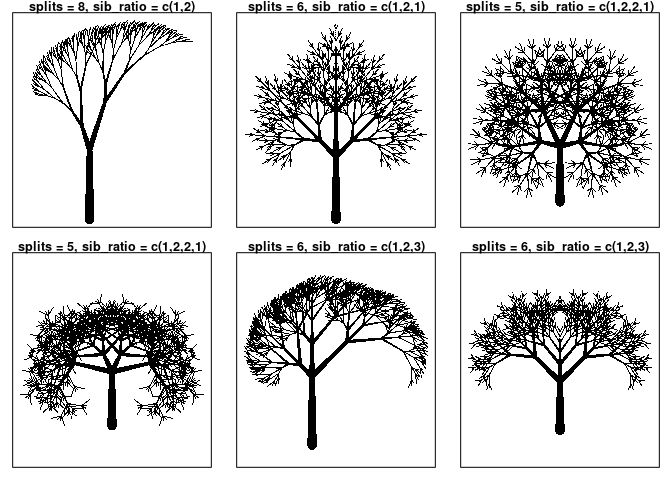
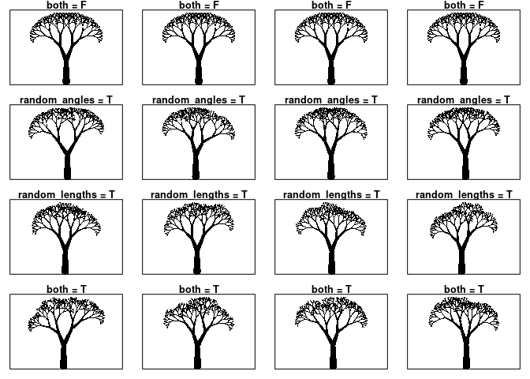
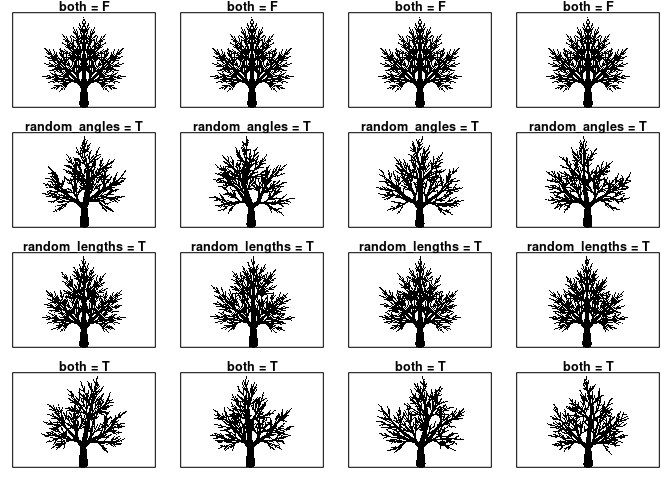
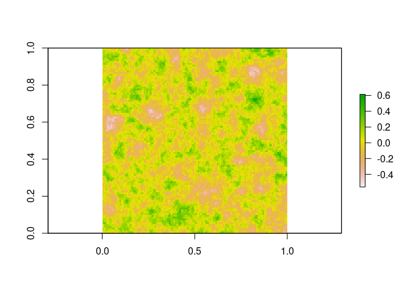

Random Trees Presentation
================
Sean Gilligan

## Fractals

Fractals are mathematical objects made from simple recursive processes
that produce potentially infinite identical patterns across many
different scales. Many fractals appear in nature. The website
<a href="http://thescienceexplorer.com/nature/8-stunning-fractals-found-nature">The
Science Explorer</a> provides some examples which I have reproduced
below. The package I’ve written allows for the production of fractal
trees, both deterministic and with some added randomness in a couple
domains. It also allows for gif production to make trees that sway in
the wind.


``` r
devtools::load_all()
```

## Deterministic Trees

<pre><code>
<b>basic_deterministic_trees</b>(splits = 3, length = 2, scale_length = T, length_scale = 1.4, children = 2, 
start_angle = 0, angle = pi/(splits/2 + 1), scale_angle = T, angle_scale = sqrt(1.272018), thickness = 2, 
scale_thickness = T, thickness_scale = 1.61803, taper = T, man_lengths = 0, man_angles = 0, 
man_split_thickness = 0, man_begin_thick = 0, man_end_thick = 0, man_children = 0, sib_ratio = 0, 
title = NA, plot = T, datadump = F)
</code></pre>

<pre><code>
<b>splits</b>                 : (int) Indicates number of levels beyond starting branch. 
<b>length</b>                 : (dbl) Indicates length of a branch. 
<b>scale_length</b>           : (lgl) Indicates if lengths should be scaled at each new level. 
<b>length_scale</b>           : (dbl) Indicates rate in which branch lengths shorten at each level. 
<b>children</b>               : (int) Indicates number of new branches at each new level. 
<b>start_angle</b>            : (dbl) Indicates angle in radians of starting branch, measured ccw from 
                               the +y direction. 
<b>angle</b>                  : (dbl) Indicates angle in radian between each branch at a split. 
<b>scale_angle</b>            : (lgl) Indicates if branch split angles should be scaled at each new level. 
<b>angle_scale</b>            : (lgl) Indicates rate at which angles should decrease 
<b>thickness</b>              : (dbl) Indicates thickness of a branch. 
<b>scale_thickness</b>        : (lgl) Indicates if thickness should should shrink at each new level 
<b>thickness_scale</b>        : (dbl) Indicates rate in which branch thicknesses should shrink 
<b>taper</b>                  : (lgl) Indicates if branches should taper. 

<b>man_lengths</b>            : Manually select branch length for starting branch and branches at each level. 
<b>man_angles</b>             : Manually select angles between branches at each split by level. 
<b>man_split_thickness</b>    : Manually select thickness of each branch at each split in order. 
<b>man_begin_thick</b>        : Manually select starting thickness by level. 
<b>man_end_thick</b>          : Manually select ending thickness. 
<b>man_children</b>           : Manually select number of branches at split by level. 
<b>sib_ratio</b>              : Only works if equal number of children at each split. Vector indicates 
                         relative size of children at each split. 
<br>
<b>title</b>                  : (chr) Optional title for output tree. 
<b>plot</b>                   : (lgl) Default to T for plotting 
<b>datadump</b>               : (lgl) Default to F. Set to T get relevant data.
</code></pre>

#### Testing “splits” input with others set to default

``` r
par(mfrow=c(2,3), mar=c(1,1,1,1))
basic_deterministic_trees(splits = 1, title = "splits = 1")
basic_deterministic_trees(splits = 2, title = "splits = 2")
basic_deterministic_trees(title = "default splits = 3")
basic_deterministic_trees(splits = 4, title = "splits = 4")
basic_deterministic_trees(splits = 5, title = "splits = 5")
basic_deterministic_trees(splits = 6, title = "splits = 6")
```

<!-- -->

#### Test “children” and “man\_children” with others set to default

``` r
par(mfrow=c(2,2), mar=c(1,1,1,1))
basic_deterministic_trees(children = 1, title = "children = 1")
basic_deterministic_trees(title = "default children = 2")
basic_deterministic_trees(children = 3, title = "children = 3")
basic_deterministic_trees(children = 4, title = "children = 4")
```

<!-- -->

``` r
par(mfrow=c(2,2), mar=c(1,1,1,1))
basic_deterministic_trees(man_children = c(2,3,4), title = "man_children = c(4,3,2)")
basic_deterministic_trees(man_children = c(3,2,3), title = "man_children = c(3,2,3)")
# Having "man_children" length =/= "splits" changes "splits" to length.
basic_deterministic_trees(man_children = 4, title = "man_children = 4")
basic_deterministic_trees(man_children = c(3,3,3,3,3), title = "man_children = c(3,3,3,3,3)")
```

<!-- -->

#### The role of tapering and scaling at each split for “splits = 5”

``` r
par(mfrow=c(2,3), mar=c(1,1,1,1))
basic_deterministic_trees(splits = 5, title = "all = T")
basic_deterministic_trees(splits = 5, taper = F, title = "scale_thickness = T, taper = F")
basic_deterministic_trees(splits = 5, scale_thickness = F, taper = F, title = "scale_thickness = F, taper = F")
basic_deterministic_trees(splits = 5, scale_length = F, title = "scale_length = F")
basic_deterministic_trees(splits = 5, scale_angle = F, title = "scale_angle = F")
```

<!-- -->

#### Explore “sib\_ratio” which determines relative length of children at each split

``` r
par(mfrow=c(2,3), mar=c(1,1,1,1))
basic_deterministic_trees(splits = 8, sib_ratio = c(1,2), title = "splits = 8, sib_ratio = c(1,2)")
basic_deterministic_trees(splits = 6, sib_ratio = c(1,2,1), title = "splits = 6, sib_ratio = c(1,2,1)")
basic_deterministic_trees(splits = 5, sib_ratio = c(1,2,2,1), title = "splits = 5, sib_ratio = c(1,2,2,1)")
basic_deterministic_trees(splits = 5, sib_ratio = c(2,1,1,2), title = "splits = 5, sib_ratio = c(1,2,2,1)")
basic_deterministic_trees(splits = 6, sib_ratio = c(1,2,3), title = "splits = 6, sib_ratio = c(1,2,3)")
basic_deterministic_trees(splits = 6, sib_ratio = c(2,1,2), title = "splits = 6, sib_ratio = c(1,2,3)")
```

<!-- -->

#### Explore “trunk\_scale”. It simply shrinks the starter branch. Other arguments: “splits = 6, angle\_scale = 1.25, sib\_ratio = c(1,5,1)”

``` r
par(mfrow=c(1,3), mar=c(1,1,1,1))
basic_deterministic_trees(splits = 6, angle_scale = 1.25, sib_ratio = c(1,5,1), title = "default: trunk_scale = 1")
basic_deterministic_trees(splits = 6, trunk_scale = 0.75, angle_scale = 1.25, sib_ratio = c(1,5,1), title = "trunk_scale = 0.75")
basic_deterministic_trees(splits = 6, trunk_scale = 0.25, angle_scale = 1.25, sib_ratio = c(1,4,1), title = "trunk_scale = 0.25")
```

<!-- -->

## The Nature of Code - Daniel Shiffman

Chapter 9 of Daniel Shiffman’s
<a hreg="https://natureofcode.com/book/chapter-8-fractals/">book</a>
discusses fractals and random/deterministic trees. It was the main
inspiration for this project, and part of my goal was to be able to
casually reproduce some of the examples he provides. I do so below.

#### Daniel’s trees:


#### My trees:

``` r
par(mfrow=c(1,3), mar=c(1,1,1,1))
basic_deterministic_trees(splits = 8, children = 2, angle = 9*pi/12, scale_angle = F, 
                          scale_thickness = F, taper = F, thickness = 0.5, length_scale = 1.5)
basic_deterministic_trees(splits = 8, children = 2, angle = pi/4, scale_angle = F, 
                          scale_thickness = F, taper = F, thickness = 0.5, length_scale = 1.5)
basic_deterministic_trees(splits = 8, children = 2, angle = pi/20, scale_angle = F, 
                          scale_thickness = F, taper = F, thickness = 0.5, length_scale = 1.5)
```

<!-- -->

## Random Trees

Essentially the same as <code>deterministic\_trees()</code> but adds a
few additional arguments.

<pre><code>
<b>random_angles</b>             : (lgl) Toggles angle noise on/off. Random values currently chosen 
                             via sampling from normal distribution.
<b>angle_variance</b>            : (dbl) Indicates base variance for angle noise. By default "set" to 
                                 zero be given value based on other inputs. In particular by (angles[2]/4)^2, 
                             where angles[2] is the angle between branches at the first split.
<b>random_lengths</b>            : (lgl) Toggles length noise on/off. Random values currently chosen via 
                             sampling from normal distribution.
<b>length_variance</b>           : (dbl) Indicates base variance for length noise. By default "set" to 
                              zero be given value later based on other inputs. In particular by lengths[1]/24, 
                             where lengths[1] is the length of the starting branch.
</code></pre>

The effects look admittedly better for some tree specifications than
others.

``` r
titles <- rep(c("both = F", "random_angles = T", "random_lengths = T", "both = T"), each = 4)
ras <- rep(c(F,F,F,F,T,T,T,T), 2)
rls <- c(rep(F,8),rep(T,8))
```

#### splits = 8, children = 2, angle = pi/4, scale\_angle = F, length\_scale = 1.4

``` r
par(mfrow=c(4,4), mar=c(1,1,1,1))
for(i in 1:16){
  random_trees(splits = 8, children = 2, angle = pi/4, scale_angle = F, length_scale = 1.4, random_angles = ras[i], random_lengths = rls[i], title = titles[i])
}
```

<!-- -->

#### splits = 6, trunk\_scale = 0.75, angle\_scale = 1.25, sib\_ratio = c(1,3,1)

``` r
par(mfrow=c(4,4), mar=c(1,1,1,1))
for(i in 1:16){
  random_trees(splits = 6, trunk_scale = 0.5, angle_scale = 1.25, sib_ratio = c(1,3,1), random_angles = ras[i], random_lengths = rls[i], title = titles[i])
}
```

<!-- -->

## Animating Trees

Both functions above allow the user to store the output data of the tree
for potential later modification. The function
<code>swaying\_tree()</code> takes this data dump as an input with a
couple randomness variables to simulate wind patterns in the form of a
random field of to create a GIF of a “swaying” tree. The images for the
GIF file are stored locally before being deleted upon GIF formation.

``` r
fractal_tree <- suppressMessages(random_trees(splits = 8, children = 2, angle = pi/4, scale_angle = F, random_angles = T, 
                                              random_lengths = T, length_scale = 1.4, plot = F, datadump = T))
```

This code lives in the function <code>swaying\_tree()</code>, with
exception of the plotting.

``` r
model <- RandomFields::RMexp(var = 0.02, scale = 0.4)
branch_count <- sum(cumprod(fractal_tree$fun_variables$children)) + 1
x <- seq(0, 10, length.out = 100)
y <- seq(0, 10, length.out = branch_count)
simu <- suppressMessages(as.matrix(RandomFields::RFsimulate(model, x, y, grid=TRUE)))

raster::plot(raster::raster(simu))
```

<!-- -->

An example input and possible GIF.

``` r
swaying_tree(fractal_tree, var = 0.02, scale = 0.4)
```

    ## [1] GIF file saved as swaying_trees/swaying_tree_2020-12-03_10:34:05_PST.gif within folder 'swaying_trees' in current directory.


