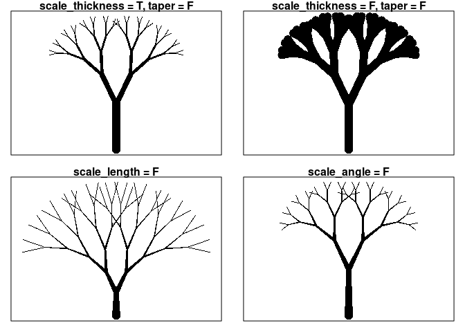
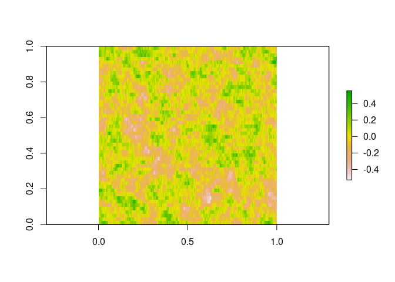

Random Trees Report
================
Sean Gilligan

``` r
devtools::load_all()
```

## Fractals

Fractals are mathematical objects made from simple recursive processes
that produce potentially infinite identical patterns across many
different scales. Many fractals appear in nature, from snowflakes,
nautilus shells, flowers, rivers, trees, and romanesco broccoli. The
package I’ve written allows for the production of fractal trees, both
deterministic and with some added randomness in a couple domains. It
also allows for animated GIF production to demonstrate “growing” trees
and trees “swaying” in the wind. The user can also choose to save most
of the data used in tree construction and display.

``` r
deterministic_tree(splits = 8, children = 2, angle = 9*pi/12, scale_angle = F, 
                   scale_thickness = F, taper = F, thickness = 0.5, length_scale = 1.5)
```


## Deterministic Trees

The main inputs for the function <b>deterministic\_tree()</b> allow the
user to decide how many splits there are, how many branches are produced
at each split, the angles between branches, the thicknesses, and the
lengths. In regard to the last three items there exist additional
functionality to set an iterative scaling process that reduces these
parameters for subsequent generations, as well produce disparities
between branch siblings. Some minor demonstrations are shown below.
Unless indicated otherwise all other arguments are set to their default
values. For a more thorough exploration of the arguments and their
effects, please see
<a href="https://github.com/ST541-Fall2020/swankydoodledandy-project-randomtrees/blob/master/basic_deterministic_trees.md">basic\_deterministic\_trees.md</a>.

``` r
par(mfrow=c(2,2), mar=c(1,1,1,1))
deterministic_tree(splits = 1, title = "splits = 1")
deterministic_tree(title = "default splits = 3")
deterministic_tree(splits = 5, title = "splits = 5")
deterministic_tree(splits = 7, title = "splits = 7")
```


``` r
par(mfrow=c(1,2), mar=c(1,1,1,1))
deterministic_tree(title = "default children = 2")
deterministic_tree(children = 3, title = "children = 3")
```


``` r
par(mfrow=c(2,2), mar=c(1,1,1,1))
deterministic_tree(splits = 5, taper = F, title = "scale_thickness = T, taper = F")
deterministic_tree(splits = 5, scale_thickness = F, taper = F, title = "scale_thickness = F, taper = F")
deterministic_tree(splits = 5, scale_length = F, title = "scale_length = F")
deterministic_tree(splits = 5, scale_angle = F, title = "scale_angle = F")
```



## Random Trees

The function <b>deterministic\_tree()</b> is actually a wrapper around
the function <b>random\_tree()</b> that turns all the default
randomizing parameters off. As written, the function
<b>deterministic\_tree()</b> cannot introduce randomness on its own. The
included randomization options in <b>random\_tree()</b> allow for
uniformly adding some Gaussian noise to angles and lengths for branches.
Variances can be set by the user, but reasonable default values are
included as well. A brief exploration is shown below. For more
information please see
<a href="https://github.com/ST541-Fall2020/swankydoodledandy-project-randomtrees/blob/master/random_trees.md">random\_trees.md</a>.
Also on the other side of this link is a timing comparison between the
current function code and an older iteration. The system time difference
achieved by vectorization of tree construction is on the order of 10.

``` r
titles <- rep(c("both = F", "random_angles = T", "random_lengths = T", "both = T"), each = 4)
ras <- rep(c(F,F,F,F,T,T,T,T), 2)
rls <- c(rep(F,8),rep(T,8))
```

#### splits = 8, children = 2, angle = pi/4, scale\_angle = F, length\_scale = 1.4

``` r
par(mfrow=c(4,4), mar=c(1,1,1,1))
for(i in 1:16){
  random_tree(splits = 8, children = 2, angle = pi/4, scale_angle = F, length_scale = 1.4, random_angles = ras[i], random_lengths = rls[i], title = titles[i])
}
```


## Saving tree data

The data of a generated tree can be returned for user use by setting the
argument <b>datadump = T</b>. This feature is required for the use of
the provided animation functions. An additional function
<b>plot\_tree()</b> can be used to plot the stored output in the form in
which it is given to the user. Here is an example in which the argument
<b>plot = F</b> means the figures of these trees will not be shown upon
construction.

``` r
fractal_tree1 <- random_tree(splits = 9, children = 2, angle = pi/4, sib_lgth_ratio = c(1.5,1), sib_thk_ratio = c(1,1.5), 
                             angle_scale = 1.05, length_scale = 1.35, plot = F, datadump = T, title = "fractal_tree1")
fractal_tree2 <- deterministic_tree(splits = 7, trunk_scale = 0.25, angle_scale = 1.25, sib_thk_ratio = c(1,2,1), 
                                    sib_lgth_ratio = c(1,5,1), plot = F, datadump = T, title = "fractal_tree2")
fractal_tree3 <- random_tree(splits = 7, sib_lgth_ratio = c(1,2,1), angle = pi/6, plot = F, datadump = T, title = "fractal_tree3")
```

The function <b>plot\_tree()</b> is now called to plot it.

``` r
par(mfrow=c(1,3), mar=c(1,1,1,1))
plot_tree(fractal_tree1)
plot_tree(fractal_tree2)
plot_tree(fractal_tree3)
```


## Animating trees

This package includes two functions for animating trees.

The first is <b>swaying\_tree()</b>. This function takes as input one
saved tree output, randomization information for the “wind”, and a
logical input telling the function to output the name of the created
file in the form of string. As stated before, the file type is a GIF. A
folder titled “swaying\_trees” is generated in the current working
directory where generated files will be placed. Similarly, for the
function <b>growing\_tree()</b>, a folder “growing\_trees” is generated.
This function simply plots the tree data in an order that makes it
appear to be growing. It takes the same inputs as
<b>swaying\_tree()</b>, minus the randomization information. To see an
example of these functions in action, including embedded GIFs, please
see
<a href="https://github.com/ST541-Fall2020/swankydoodledandy-project-randomtrees/blob/master/animated_tree.md">animated\_tree.md</a>.

An example of <b>swaying\_tree()</b>’s “wind” is shown below. The output
values are mapped to angle modifications to each branch as they “move”
along the random field, or as the field “moves” along them.

``` r
model <- RandomFields::RMexp(var = 0.02, scale = 0.4)
branch_count <- sum(cumprod(fractal_tree1$fun_variables$children)) + 1
x <- seq(0, 10, length.out = 50)
y <- seq(0, 10, length.out = branch_count)
simu <- suppressMessages(as.matrix(RandomFields::RFsimulate(model, x, y, grid=TRUE)))

raster::plot(raster::raster(simu))
```


